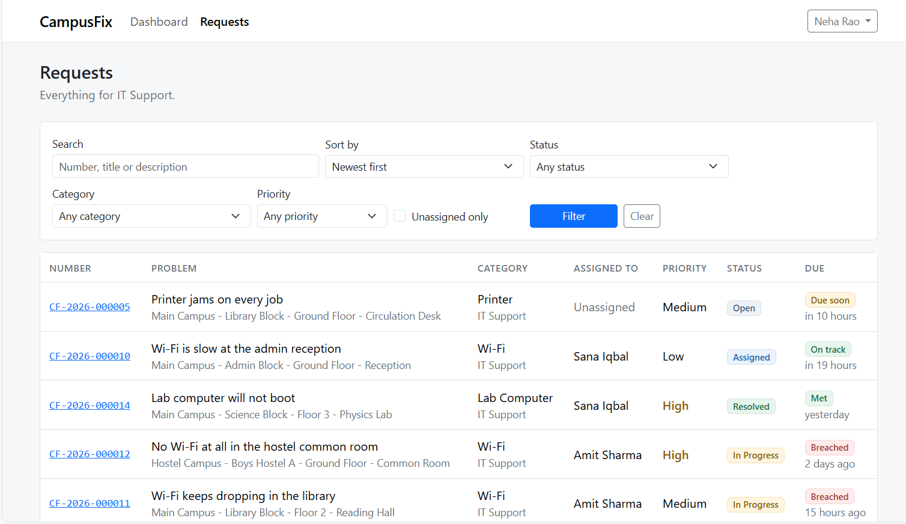
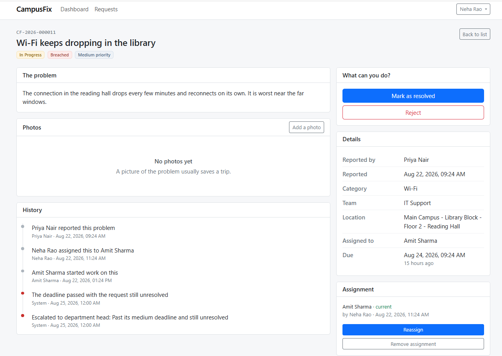

# CampusFix

A service-desk application for a college campus. A student reports a broken fan
or dead Wi-Fi, the system works out which department is responsible, a
department head assigns it to a technician, and the student is the one who
decides whether it is actually fixed.

Built with Spring Boot and MySQL, with a plain HTML/JavaScript frontend served
by the same application. No Node, no bundler — `./mvnw spring-boot:run` is the
whole toolchain.

---

## Screenshots

> Add these to `screenshots/` and they will show up here.

| | |
|---|---|
|  |  |
| The department head's queue, with SLA state on every row | One request: description, photos, timeline and the actions available to *you* |

---

## What it does

**Students** report a problem by picking a category — never a department. Wi-Fi
goes to IT Support, a flickering tube light goes to Electrical. They can attach
photos, follow the request through its timeline, and confirm or reopen it when a
technician says it is fixed.

**Technicians** see only the work assigned to them. They start it, then record
what they actually did when they mark it resolved.

**Department heads** see their whole department including the unassigned queue,
assign work to technicians (with each technician's current workload shown), and
can reject duplicates with a reason.

**Admins** manage departments, categories, locations, users and the SLA targets.

Behind all of it, a scheduled job watches deadlines. A request past its target
goes to the department head; still unresolved a day later, it goes to
administration. Both are recorded on the request's timeline.

---

## Running it

### You need

- JDK 21 or later
- MySQL 8
- No Maven install — use the wrapper (`./mvnw`)

### Setup

Create the database:

```sql
CREATE DATABASE campusfix CHARACTER SET utf8mb4 COLLATE utf8mb4_unicode_ci;
```

Point the app at your MySQL. It reads these from the environment and falls back
to a local-development default:

```bash
export DB_USERNAME=root
export DB_PASSWORD=your_password
```

Then run it with demo data:

```bash
./mvnw spring-boot:run -Dspring-boot.run.profiles=demo
```

Open <http://localhost:8080>.

The `demo` profile fills an empty database with four departments, twelve
categories, eleven locations, sixteen people and seventeen requests spread across
every status and every SLA state — including some already breached, so the
escalation behaviour is visible immediately. It only runs when there are no
requests yet, so it will never overwrite real data.

Drop the profile flag to start with an empty system. You still get an
administrator account, printed in the startup log.

### Demo accounts

Every seeded account uses the password `demo1234`.

| Email | Role | What you see |
|---|---|---|
| `priya.nair@college.edu` | Student | Only her own three requests |
| `amit.sharma@college.edu` | Technician, IT Support | Only work assigned to him |
| `neha.rao@college.edu` | Department head, IT Support | All seven IT requests, plus the unassigned queue |
| `admin@campusfix.local` | Administrator | Everything — password is `admin12345` |

Signing in as each of these in turn is the fastest way to see what the
application actually does, because the same request looks different to each of
them.

### Tests

```bash
./mvnw test
```

48 tests, all on the service layer with mocked repositories, so they run in a few
seconds and no MySQL is needed — the test profile uses in-memory H2.

---

## How it's built

```
Controller   reads the HTTP request, hands over a DTO, returns a DTO
    ↓        knows no business rules
Service      enforces the rules, owns the transaction
    ↓        this is where the thinking lives
Repository   talks to the database
    ↓
Entity       a row, as a Java object
```

Packages are grouped by feature — everything about requests is in
`com.campusfix.request` — rather than by layer. A change to one feature touches
one folder.

**Stack:** Java 21, Spring Boot 3.5, Spring Security with JWT, Spring Data JPA,
MySQL 8, Bootstrap 5. AWS SDK for the optional S3 storage adapter.

---

## Some decisions worth explaining

These are the parts I'd want to talk about, and the reasoning behind them.

**The status workflow is a table, not a pile of if-statements.** Every legal move
is one row of an enum: which statuses it can be used from, what it changes the
request to, who is entitled to do it, and whether they have to explain
themselves. A request cannot go from `OPEN` to `CLOSED` — not because a check
forbids it, but because no action does that. The entity's status methods are
package-private, so nothing outside the workflow can write the field at all.

**Only the student who reported a problem can confirm it is fixed.** Not the
technician, not an admin. Nobody else can truthfully say whether the fan in
someone's room is working, and if staff could close their own work, the
resolution rate would be a number they award themselves.

**Reading someone else's request returns 404, not 403.** A 403 confirms the id
exists, which lets anyone walk `/api/requests/1`, `/2`, `/3` and learn how many
requests the college has and when activity peaks. From outside your scope, it
simply is not there.

**Visibility is pushed into the SQL, not applied afterwards in Java.** A role
becomes two or three filter values that go into the WHERE clause, so the database
never returns rows the caller may not see. Fetching everything and filtering in
Java means one forgotten condition leaks the whole table — and it does not
paginate correctly either. Search was added the same way, as one more condition
in the same query, so searching cannot be used to see another student's requests.

**The SLA deadline is stored; the SLA state is not.** `due_at` is written once at
creation, because it is a promise made at a moment in time — if the college
shortens the target for medium-priority work tomorrow, a request filed today
should keep the window it was actually given, and last month's met targets should
not silently become breaches. The state (`on track` / `due soon` / `breached`) is
the opposite: it changes with the clock alone, so storing it would mean a column
that is wrong most of the time.

**Uploads are checked against the file's magic bytes.** A browser sends a
filename and a `Content-Type` header, and both are typed by whoever is uploading
— anyone can rename `shell.php` to `photo.jpg`. So the first twelve bytes are
read and compared against the real signature of each accepted format. The stored
path is `requests/{id}/{uuid}.{ext}`; nothing the uploader typed ever becomes
part of a path.

**Roles are an enum column, not a lookup table.** I had a `roles` table in my
original design and dropped it. A lookup table earns its place when rows can be
added at runtime, and roles cannot — the code decides what each one is allowed to
do, so a fifth row inserted by hand would have no permissions attached to it
anywhere. The table would look configurable while being nothing of the sort.

---

## Storage

Attachments go through a `FileStorage` interface with two implementations:

- **local disk** by default, so a fresh clone runs with no cloud account
- **S3-compatible** under the `s3` profile — the same class talks to MinIO
  locally and to AWS in production, differing only by two config properties

The service that saves an attachment knows only the interface. Where a photo
physically lives is a deployment decision.

To run against MinIO:

```bash
docker run -d -p 9000:9000 -p 9001:9001 --name minio \
  -e MINIO_ROOT_USER=campusfix -e MINIO_ROOT_PASSWORD=campusfix123 \
  quay.io/minio/minio server /data --console-address ":9001"
```

Create a bucket called `campusfix`, then:

```bash
AWS_ACCESS_KEY_ID=campusfix AWS_SECRET_ACCESS_KEY=campusfix123 \
S3_ENDPOINT=http://localhost:9000 \
./mvnw spring-boot:run -Dspring-boot.run.profiles=s3
```

---

## What it doesn't do

Being straight about the gaps, because every one of these was a decision rather
than an oversight:

- **No notifications.** Nobody is emailed when their request is resolved; they
  have to look. A bell icon that never rings would be worse than its absence.
- **JWTs cannot be revoked.** Deactivate a user and their existing token works
  until it expires, eight hours later. That is the cost of a stateless API, and
  the alternatives — refresh tokens, a denylist, checking `active` on every
  request — all put the server's state back. Acceptable when deactivation means
  "this person left" rather than "this account is compromised right now".
- **No Redis, deliberately.** Nothing here is slow enough to justify a cache. I'd
  rather explain why I left it out than have an unjustified dependency.
- **Search is a table scan.** `LIKE '%text%'` has a leading wildcard so no index
  helps. Fine for a college's volume; a `FULLTEXT` index is the answer if it ever
  isn't.
- **The S3 adapter is written but untested** — I had no MinIO instance to run it
  against. Local disk is verified end to end.
- **Not deployed yet, and no Docker setup.** Next on the list.
- **No comments on requests.** Only the fixed set of workflow notes exists, so a
  student cannot ask "any update?".
- **Tests cover the service layer only.** No controller or integration tests yet;
  the endpoint rules were checked by hand against the running application.

---

## Layout

```
src/main/java/com/campusfix/
├── auth/          login, JWT issuing, current user
├── request/       service requests, assignment, status workflow
├── attachment/    photo upload and download
├── sla/           SLA targets, breach detection, escalation
├── activity/      the timeline written on every change
├── user/          accounts and roles
├── department/    the teams
├── category/      problem types, each pointing at a department
├── location/      where on campus
├── demo/          the demo data seeder
└── common/        security, storage, error handling, shared config

src/main/resources/static/    the frontend: one HTML file per screen,
                              one small JS file each, four shared files
```
